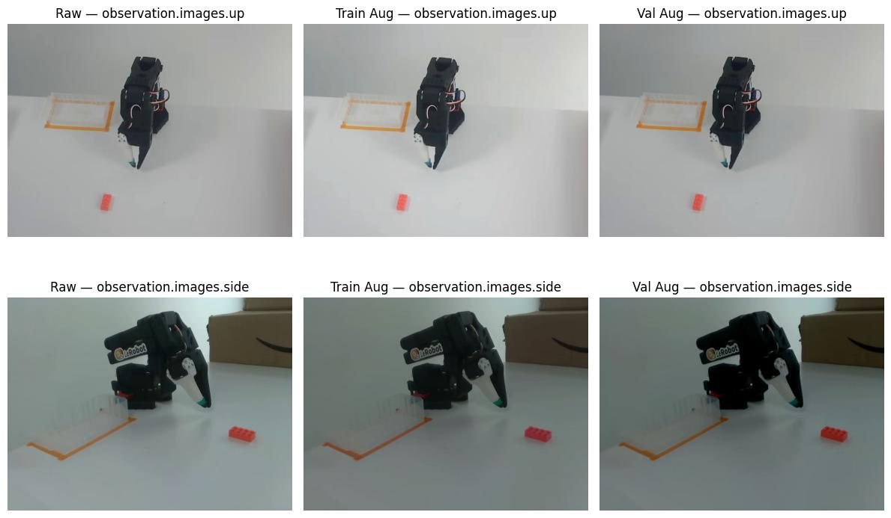

## SmolVLA Colour Aug Challenge

# Robust SmolVLA Manipulation Pipeline

   

A robust Vision-Language-Action (VLA) training pipeline for robotic manipulation. This project fine-tunes **SmolVLA** on the **SO-100 Pick & Place dataset**, specifically designed to handle **distributional shifts** (lighting and color variations) between training and validation environments.

### 🚀 Key Results
* **Robustness:** Successfully trained on standard RGB distributions and validated on shifted distributions (darker/higher contrast).
* **Performance:** Achieved **60.92% Average Per-Joint Success Rate** (within 5% tolerance) on unseen episodes.
* **Engineering:** Solved temporal alignment and tensor shape mismatches in the default `LeRobot` implementation for this specific dataset.

---

## 📂 Project Structure

| File | Description |
| :--- | :--- |
| **[`train_policy.ipynb`](01_train_smolvla.ipynb)** | Complete training pipeline with custom augmentation, chunking, and checkpointing. |
| **[`eval_policy.ipynb`](02_eval_offline.ipynb)** | Offline evaluation script implementing "Percent-Close" metrics and denormalization logic. |

---

## 🏗 Architecture & Approach

### Model: SmolVLA
* **Type:** Vision-Language-Action (VLA) Policy
* **Base:** `lerobot/smolvla_base`
* **Control:** Autoregressive action prediction with **Chunk Size = 50**

### Dataset: SO-100 Pick-Place
* **Source:** `lerobot/svla_so101_pickplace`
* **Split Strategy:** Strict episode-based splitting to prevent temporal leakage.
    * **Train:** Episodes 0–39 (9,180 samples)
    * **Val:** Episodes 40–49 (2,759 samples)
### 🎥 Episode Preview
[Screencast from 2025-12-12 19-22-09.webm](https://github.com/user-attachments/assets/2b3d4491-bd0e-4e20-a902-aca05525c08d)
---


## 🔧 Technical Challenges & Solutions

### 1. Robustness via Domain Randomization
To simulate **Sim-to-Real** lighting gaps, I implemented asymmetric augmentation pipelines using `ImageTransformsConfig`.

* **Training Distribution:** Standard variance (Brightness/Contrast ±20%).
* **Validation Distribution:** Shifted variance (Darker, higher contrast) to test generalization.


*Figure 1: Comparison of Raw inputs vs. Augmented Training (Center) and Shifted Validation (Right). Note the darker lighting conditions in the validation set.*

```python
train_transforms = ImageTransformsConfig    # from lerobot.datasets.transforms
(                  
    enable=True,
    max_num_transforms=2,
    random_order=True,
    tfs={
        "brightness": ImageTransformConfig(
            weight=1.0, type="ColorJitter", kwargs={"brightness": (0.8, 1.2)}
        ),
        "contrast": ImageTransformConfig(
            weight=1.0, type="ColorJitter", kwargs={"contrast": (0.8, 1.2)}
        ),
        "saturation": ImageTransformConfig(
            weight=1.0, type="ColorJitter", kwargs={"saturation": (0.5, 1.5)}
        ),
        "hue": ImageTransformConfig(
            weight=1.0, type="ColorJitter", kwargs={"hue": (-0.05, 0.05)}
        ),
    },
)
```

**Val Configuration** (shifted distribution - darker, higher contrast):
```python
val_transforms = ImageTransformsConfig    # from lerobot.datasets.transforms
( 
    enable=True,
    max_num_transforms=2,
    random_order=True,
      tfs={
        "brightness": ImageTransformConfig(
            weight=1.0, type="ColorJitter", kwargs={"brightness": (0.7, 1.0)}
        ),
        "contrast": ImageTransformConfig(
            weight=1.0, type="ColorJitter", kwargs={"contrast": (1.0, 1.3)}
        ),
        "saturation": ImageTransformConfig(
            weight=1.0, type="ColorJitter", kwargs={"saturation": (0.5, 1.2)}
        ),
        "hue": ImageTransformConfig(
            weight=1.0, type="ColorJitter", kwargs={"hue": (-0.08, 0.06)}
        ),
    }
)
```

This tests the model's ability to generalise under lighting/colour variations.

---

### 3. Episode-Based Splitting

**Why it matters**: Prevents temporal data leakage between train and val sets.
```python
episode_idx = np.array(base_ds.hf_dataset["episode_index"])
train_indices = [i for i, ep in enumerate(episode_idx) if ep < 40]
val_indices = [i for i, ep in enumerate(episode_idx) if ep >= 40]

# Final counts
# Train: 9,180 samples | Val: 2,759 samples
```

---

### 4. Camera Key Remapping

**Problem**: Dataset uses `observation.images.up` / `observation.images.side`, but SmolVLA expects `camera1` / `camera2`.

**Solution**:
```python
def fix_keys(batch):
    if "observation.images.up" in batch:
        batch["observation.images.camera1"] = batch.pop("observation.images.up")
    if "observation.images.side" in batch:
        batch["observation.images.camera2"] = batch.pop("observation.images.side")
    return batch
```

---
### 5. Temporal Alignment (Tensor Mismatch)
The Challenge: The model architecture requires a 50-step action chunk, but the raw dataset provided single-step actions, causing RuntimeError: tensor size mismatch (227 vs 178).

The Solution: Engineered a delta_timestamps vector to pre-fetch future action horizons aligned with the dataset's 30 FPS rate.

```python

fps = 30
action_horizon = 50
# Construct temporal query vector
delta_timestamps = {
    "action": [i / fps for i in range(action_horizon)]  # [0.0, 0.033, ... 1.66s]
}
```
---

## Evaluation Methodology

### Challenge: Action Normalisation

**Problem #1**: Initial eval showed MAE in the thousands and success rate was 0%.

**Root Cause**: Model outputs normalised actions, but ground truth is in original units.

**Problem #2**: `policy.forward()` returns loss dict, not actions.

**Solution**: Use policy.predict_action_chunk() + proper denormalization:
```python
1-
pred_seq = policy.predict_action_chunk(batch)  # (B, 50, action_dim)
pred_action = pred_seq[:, 0, :]  # First action in chunk

2. Denormalise predictions
meta = LeRobotDatasetMetadata(DATASET_REPO)
action_mean = torch.tensor(meta.stats["action"]["mean"])
action_std = torch.tensor(meta.stats["action"]["std"])

pred_unnorm = pred_action * action_std + action_mean
```

### Final Results

**Per-Joint Success @ 5% Tolerance**:
```
joint 0: 45.81%
joint 1: 47.88%
joint 2: 70.06%
joint 3: 77.46%
joint 4: 60.86%
joint 5: 63.43%

Average per-joint success (5%): 60.92%

```
---
## References

- Course: https://huggingface.co/spaces/lerobot/robot-learning-tutorial
- SmolVLA: https://huggingface.co/blog/smolvla
- Dataset: https://huggingface.co/datasets/lerobot/svla_so101_pickplace
- LeRobot: https://github.com/huggingface/lerobot
